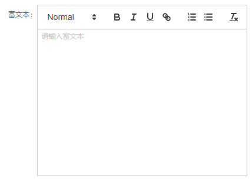
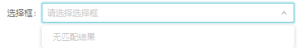

# IndustrialPark_Web
产业园后台管理系统项目，基于 React, Redux, React-Router及antd的后台管理系统

# Prepareration

  ```git clone http://112.124.41.46/fe-group/industrialpark_web.git```
  ```yarn / npm install```

# Contributors
  Fix this

# 开发Tips
## 快速生成模块
TODO
## 可用二次封装组件

- Captcha 手机验证码输入框

  
  
  成员 | 说明 | 类型 | 默认值
  :---:|:---:|:---: | :---:
  count | 重新发送倒计时 | number | 60
  onClick | 按钮按下时触发,需返回promise  | function | 
  value | 值 | string |
  onChange | 输入改变时触发 | function(value)
  
- DatePicker 日期选择框
  
  
  
  成员 | 说明 | 类型 | 默认值
  :---:|:---:|:---: | :---:
  value | 值 | string/date: monent |
  onChange | 选择改变时触发 | function(value)
  
- Editor 富文本编辑框
  
  
    
  成员 | 说明 | 类型 | 默认值
  :---:|:---:|:---: | :---:
  value | 值 | string |
  onChange | 输入改变时触发 | function(value)
  
- ImagePicker 图片上传框
  
  
  
  成员 | 说明 | 类型 | 默认值
  :---:|:---:|:---: | :---:
  tokenSeparators | 值分隔符 | string |
  value | 值 | string/array |
  onChange | 选择改变时触发 | function(value)
  
- Input 输入框

  
  
  成员 | 说明 | 类型 | 默认值
  :---:|:---:|:---: | :---:
  value | 值 | string |
  onChange | 输入改变时触发 | function(value)
  
- MonthPicker 月份选择框
  
  
  
  成员 | 说明 | 类型 | 默认值
  :---:|:---:|:---: | :---:
  value | 值 | string/date: monent |
  onChange | 选择改变时触发 | function(value)
  
- MonthRange 月份范围选择框
  
  
  
  成员 | 说明 | 类型 | 默认值
  :---:|:---:|:---: | :---:
  value | 值 | array |
  onChange | 选择改变时触发 | function(value)
  
- Number 数字输入框

  
  
  成员 | 说明 | 类型 | 默认值
  :---:|:---:|:---: | :---:
  value | 值 | string/number |
  min | 最小值 | number |
  max | 最大值 | number |
  money | 金额格式化 | boolean | false
  onChange | 输入改变时触发 | function(value)
  
- NumberRange 数字范围输入框

  
  
  成员 | 说明 | 类型 | 默认值
  :---:|:---:|:---: | :---:
  value | 值 | array |
  startMin | 最小值 | number |
  endMax | 最大值 | number |
  onChange | 输入改变时触发 | function(value)
  
- Select 选择框

  
  
  成员 | 说明 | 类型 | 默认值
  :---:|:---:|:---: | :---:
  multiple | 多选模式 | boolean | false
  valueName | 值名称 | string | id
  displayName | 展示值名称 | string | name
  value | 值 | string/array |
  onChange | 选择改变时触发 | function(value)
  onSelect | 选择改变时触发 | function(value, record)
  page | 异步数据分页 | object(pageSize, pageNo, count, loading, data) |
  action | 分页是需设置，需返回promise  | function | 
  
- Table 表格
  
  成员 | 说明 | 类型 | 默认值
  :---:|:---:|:---: | :---:
  loading | 数据加载标志 | boolean | false
  columns | 列定义 | array | 
  dataSource | 数据 | array |
  onChange | 分页改变时触发 | function(value)
  
- 表单弹出框

  成员 | 说明 | 类型 | 默认值
  :---:|:---:|:---: | :---:
  confirmLoading | 保存按钮加载标志 | boolean | false
  fields | 字段定义 | array | 
  values | 数据 | array |
  changeRecord | 输入改变时触发 | function(fields)
  visible | 显示/隐藏 | boolean | false
  onCancel | 按取消按钮时触发 | function 
  onCreate | 按保存按钮时触发 | function
  cusTitle | 弹出框标题 | string
  formWidth | 弹出框宽度 | number | 1000
  
- 列表页
  
  成员 | 说明 | 类型 | 默认值
  :---:|:---:|:---: | :---:
  title | 标题 | string 
  loading | 数据加载标志 | boolean | false
  columns | 列定义 | array | 
  data | 数据 | array |
  
- 详情页

  成员 | 说明 | 类型 | 默认值
  :---:|:---:|:---: | :---:
  title | 标题 | string 
  loading | 数据加载标志 | boolean | false
  values | 数据 | array |
  buttons | 自定义底部按钮 | array
  children | 自定义展示快 | object(JSX) |
  changeRecord | 输入改变时触发 | function(fields)
  
## 表单配置参数一览

- name 字段名（对应接口字段名）
- label 标签名
- disabled 禁用，这里更确切的理解应为只读，用于展示
- hidden 隐藏，不作校验
- search 是否是搜索栏字段
- required 必填
- validator 自定义校验
- pattern 正则校验
- patternMsg 正则校验提示信息
- phone 是否手机号
- number 是否数字
- positive 是否正数
- ID 是否身份证
- char 是否字母数字组合
- long 占满 一行样式
- simple 占中间 一行样式
- style 自定义内联样式
- className 自定义class样式
- type 类型
  - title 标题行
  - date 日期
  - Cascader 三级地区级联
    - data 地区数据
  - datetime 日期时间
  - dateRange 日期范围
  - month 月份
  - datetimeRange 日期时间范围
  - monthRange 月份范围
  - select 下拉选择，可多选
    - data 下拉数据
    - valueName 真实值
    - displayName 表现值
    - page 分页对象
  - editor 富文本
  - checkbox 复选
  - image 图片
    - tokenSeparators 多图片分隔符
  - password 密码
  - number 数字
    - min 最小值
    - max 最大值
    - money 是否金额格式化
  - textarea 多行文本
  - radio 单选框
  - numberRange 数字范围
    - startMin 开始最小值
    - endMax 结束最大值
  - 为空 即text 输入框
    - buttonText 带按钮

## Dev
启用开发环境
  ```yarn dev```

本地启动node服务器
  ```yarn start```

## Compile
编译打包
  ```yarn compile```

## Clean
项目清理
  ```yarn clean```

## Lint
代码规范检查
  ```yarn lint```

代码规范修正
  ```yarn lint:fix```

## Coverage
代码覆盖率
  ```yarn codecov```

## Deploy
项目部署
  ```yarn deploy[:env]```

部署实际上等同于
  ```yarn lint && yarn test && yarn clean && yarn compile```

## Tests
自动化和单元测试（暂不用完成）
  ```yarn test```


# Code Submition
代码提交前，先执行
```yarn lint:fix```
对存在语法规范错误的代码进行修复后，再push到对应的分支

